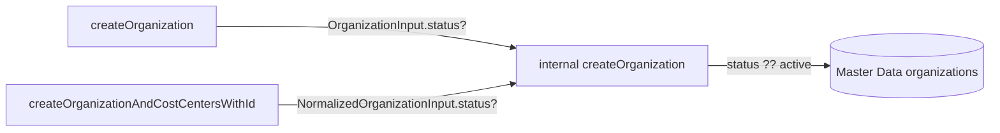

# Spec: Optional status on organization create

| Field | Value |
| --- | --- |
| Status | Draft |
| Feature | `create-organization-status` |
| App | `vtex.b2b-organizations-graphql` |
| Go-live driver | Kohler integration (target September 2026) |

---

## 1. Business Context

### Problem

Every B2B organization has a lifecycle `status` (`active`, `inactive`, or `on-hold`). Today that value can only be set through `updateOrganization`. All create paths hardcode `active` in Master Data, so integrations that must onboard an organization already as `on-hold` or `inactive` must call create and then immediately call update.

Kohler’s integration does exactly that workaround on every organization creation. It works, but adds latency, complexity, and a failure mode (create succeeds, update fails → org left `active` when it should not be).

The create/update GraphQL contract is also inconsistent: update requires `status`; create ignores it entirely.

### Who is affected

- External B2B onboarding integrations (primary: Kohler) that create organizations via GraphQL.
- Any future consumer that needs non-`active` orgs at creation time.
- Maintainers of this legacy B2B Suite app (smaller surface if create and update stay aligned).

### Goals

- Accept optional `status` on organization create so the org is persisted with the intended status in one call.
- Remain backward compatible: omitting `status` keeps today’s behavior (`active`).
- Keep the change minimal on a legacy suite being gradually discontinued — no Master Data schema change, no request-flow changes, no new validation surface beyond what update already allows.

### Non-goals

- Changing `createOrganizationRequest` / `updateOrganizationRequest` (request status is a separate domain: `pending` / `approved` / `declined`).
- Adding a GraphQL enum or server-side allow-list for organization status (update does not validate today).
- Sending `organizationStatusChanged` email on create.
- Changing create mutation response shapes (`status` on `OrganizationCostCenterResponse` / `MasterDataResponse` remains the operation result field, not lifecycle status).
- Updating Kohler or admin UI consumers in this repository.

### Requirements

1. Callers may pass `status` when creating an organization.
2. When `status` is omitted or null/undefined, the organization is created as `active`.
3. When `status` is provided, that value is persisted on the Master Data `organizations` document.
4. Both public create mutations that create an organization document must support the field.
5. Existing clients that do not send `status` must behave exactly as today.
6. Storefront and query behavior for non-`active` orgs remains unchanged (existing active checks continue to apply).

### User stories

#### US1 — Create with explicit on-hold status

**As** an integration (e.g. Kohler)  
**I want** to pass `status: "on-hold"` on create  
**So that** the organization is stored as on-hold without a follow-up update.

**Acceptance criteria**

- Given a valid `createOrganization` (or `createOrganizationAndCostCentersWithId`) input with `status: "on-hold"`  
  When the mutation succeeds  
  Then the Master Data organization document has `status` equal to `on-hold`.
- Given the same create  
  When the mutation succeeds  
  Then no `organizationStatusChanged` email is sent solely because of the create-time status.

#### US2 — Create with inactive status

**As** an integration  
**I want** to pass `status: "inactive"` on create  
**So that** the organization is inactive from the first write.

**Acceptance criteria**

- Given a valid create input with `status: "inactive"`  
  When the mutation succeeds  
  Then the Master Data organization document has `status` equal to `inactive`.

#### US3 — Omit status (backward compatible)

**As** an existing client that does not send `status`  
**I want** create to keep working unchanged  
**So that** I do not need to change my integration.

**Acceptance criteria**

- Given a valid create input without `status`  
  When the mutation succeeds  
  Then the Master Data organization document has `status` equal to `active`.
- Given existing GraphQL clients compiled against the previous schema  
  When they call create without the new field  
  Then the call remains valid (field is optional).

#### US4 — Parity with update on unconstrained string

**As** a platform maintainer  
**I want** create to accept `status` the same way update does (plain `String`, no enum)  
**So that** we do not introduce a stricter contract only on create.

**Acceptance criteria**

- Given a create input with any string `status`  
  When the mutation runs  
  Then the value is persisted without a new GraphQL enum or new allow-list validation introduced by this feature (same write posture as `updateOrganization`).

### Key scenarios

| # | Type | Scenario | Expected result |
| --- | --- | --- | --- |
| 1 | Happy path | `createOrganization` with `status: "on-hold"` | Org document persisted with `on-hold`; single GraphQL call |
| 2 | Happy path | `createOrganizationAndCostCentersWithId` with `status: "inactive"` | Org document persisted with `inactive` |
| 3 | Edge / retrocompat | Create without `status` | Org document persisted with `active` (unchanged) |
| 4 | Edge | Create with `status: "on-hold"` and `notifyUsers: true` | Existing create notification behavior only; no status-changed email |
| 5 | Error / parity | Create with an unexpected status string (same as update allows) | Value persisted; no new validation error from this feature |
| 6 | Out of scope | Approve `organization_requests` | Still creates org as `active` unless a future spec changes that path |

### Why it matters

- Removes one GraphQL round-trip per organization in Kohler’s onboarding flow.
- Aligns create and update contracts.
- Reduces dual-call failure modes before Kohler go-live (September 2026).

---

## 2. Arch Decisions

### Proposed approach

Add an optional `status: String` field to both create input types and thread it through the shared internal `createOrganization` helper, defaulting to `ORGANIZATION_STATUSES.ACTIVE` when absent.



### Key decisions

#### AD1 — Scope both create mutations, not only `createOrganization`

**Decision:** Add `status` to `OrganizationInput` and `NormalizedOrganizationInput`, covering `createOrganization` and `createOrganizationAndCostCentersWithId`.

**Rationale:** Both paths share the internal helper that hardcodes `active`. ERP-style integrations often use the fixed-ID mutation. Supporting only one mutation would leave the same workaround on the other path and increase maintenance asymmetry.

**Rejected alternative:** Change only `createOrganization`. Rejected because Kohler-like integrations frequently need custom IDs via `createOrganizationAndCostCentersWithId`.

#### AD2 — Leave organization request / approve flows unchanged

**Decision:** Do not add organization lifecycle `status` to `createOrganizationRequest` or to the approve path in `updateOrganizationRequest`.

**Rationale:** Request `status` (`pending` / `approved` / `declined`) is a different domain. Approve already creates an organization through the same helper; until a product need says otherwise, approved requests continue to create `active` orgs (default when input has no status). Expanding request UX would widen the legacy surface without a stated requirement.

#### AD3 — Optional field; default `active`

**Decision:** GraphQL field is optional. Resolver uses `status ?? ORGANIZATION_STATUSES.ACTIVE`.

**Rationale:** Explicit retrocompatibility requirement. Existing clients omit the field and must keep receiving `active`.

#### AD4 — No new status validation on create

**Decision:** Do not introduce an allow-list or GraphQL enum for create.

**Rationale:** `updateOrganization` already accepts `status: String!` with no server-side enum check. Adding validation only on create would make create stricter than update and expand maintenance. Canonical values remain documented as `active` | `inactive` | `on-hold` via constants and this spec.

**Risk accepted:** Callers can persist arbitrary strings (already true on update). Mitigation: document canonical values in docs during implementation.

#### AD5 — No `organizationStatusChanged` email on create

**Decision:** Creating with a non-`active` status does not trigger the status-changed mail template.

**Rationale:** That email models a transition from a previous status. On create there is no prior status. Existing create emails (`organizationCreated` / related settings) stay as they are today.

#### AD6 — No Master Data schema change

**Decision:** Reuse the existing indexed `status` string property on the `organizations` entity.

**Rationale:** Field already exists and is written on every create. Only the source of the value changes (input vs hardcoded constant).

#### AD7 — Minimal legacy footprint

**Decision:** Touch only schema inputs, TypeScript input types, the internal create helper (and any thin pass-through of input into that helper), tests, and docs at implementation time.

**Rationale:** B2B Suite is being discontinued gradually. Discovery and implementation must not expand unrelated surfaces (metrics for request approve/decline, storefront active gates, etc.).

### Risks and mitigations

| Risk | Mitigation |
| --- | --- |
| Integrations assume every new org is `active` | Field is optional; default remains `active` |
| Accidental wider refactor in legacy app | Spec limits file/surface list; implement only listed contract |
| Confusion between response `status` and org lifecycle status | Document that create response `status` is unchanged (operation result / empty string) |
| Kohler still calls update after create | Spec + docs enable dropping the second call; consumer change is outside this app |

### Implementation follow-ups (not part of this Draft PR)

When implementing (after Status → Approved):

1. Update `graphql/schema.graphql` inputs.
2. Update `node/typings.d.ts` input interfaces.
3. Change internal `createOrganization` in `node/resolvers/Mutations/Organizations.ts` to honor optional status.
4. Extend `node/resolvers/Mutations/Organizations.test.ts`.
5. Document optional `status` in `docs/README.md`.
6. Add CHANGELOG entry under Unreleased / next release.

---

## 3. Technical Contract

### Services and mutations in scope

| Surface | Change |
| --- | --- |
| Mutation `createOrganization` | Accepts optional `input.status` via `OrganizationInput` |
| Mutation `createOrganizationAndCostCentersWithId` | Accepts optional `input.status` via `NormalizedOrganizationInput` |
| Internal helper `createOrganization` | Persists `status ?? 'active'` instead of always `'active'` |
| Mutation `updateOrganization` | Unchanged |
| Mutation `createOrganizationRequest` | Unchanged |
| Mutation `updateOrganizationRequest` (approve → create org) | Unchanged; created org remains `active` via default |
| Master Data entity `organizations` | No schema version / property change |
| Email / metrics / storefront active checks | Unchanged behavior |

### GraphQL contract

```graphql
input OrganizationInput {
  # ...existing fields...
  status: String # optional; omit → active
}

input NormalizedOrganizationInput {
  # ...existing fields...
  status: String # optional; omit → active
}
```

Canonical lifecycle values (documentation / constants, not a GraphQL enum):

- `active`
- `inactive`
- `on-hold`

`Organization.status` on the output type is already `String` and needs no schema change.

Create mutation **response** fields named `status` (e.g. on `OrganizationCostCenterResponse`) remain operation-oriented and are **not** redefined to return lifecycle status.

### TypeScript contract

```ts
interface OrganizationInput {
  // ...existing fields...
  status?: string
}

interface NormalizedOrganizationInput {
  // ...existing fields...
  status?: string
}
```

### Persistence contract

- Data entity: `organizations` (`ORGANIZATION_DATA_ENTITY`)
- Field: `status` (string, already indexed)
- Write rule on create: `fields.status = input.status ?? ORGANIZATION_STATUSES.ACTIVE`
- No change to `ORGANIZATION_SCHEMA_VERSION` required for this feature

### Side-effect contract

| Event | On create with custom status |
| --- | --- |
| Persist MD document | Yes, with provided or default status |
| `organizationStatusChanged` email | No |
| Existing create notification paths | Unchanged (still gated by settings / `notifyUsers` as today) |
| Storefront `checkOrganizationIsActive` / cost-center storefront gates | Unchanged; non-`active` orgs remain non-active for those checks |
| `getActiveOrganizationsByEmail` | Unchanged; filters to `active` only |

### Test contract

Extend `node/resolvers/Mutations/Organizations.test.ts`:

1. Create without `status` → `createDocument` called with `status: 'active'` (existing assertion remains valid).
2. Create with `status: 'on-hold'` → `createDocument` called with `status: 'on-hold'`.
3. Create with `status: 'inactive'` → `createDocument` called with `status: 'inactive'`.
4. Cover at least one path through `createOrganizationAndCostCentersWithId` (already the primary tested create path).

### Integration impact

| Consumer | Impact |
| --- | --- |
| Existing GraphQL clients omitting `status` | None (optional field, default `active`) |
| Kohler (and similar) create-then-update flow | Can pass `status` on create and remove the follow-up `updateOrganization` for status-only updates |
| Admin UI / other B2B Suite apps | No required change; may optionally start sending `status` later |
| Organization request storefront flow | None |

### Discovery summary — what changes vs what does not

**Changes (implementation):**

- `graphql/schema.graphql` — optional `status` on both create inputs
- `node/typings.d.ts` — optional `status` on both input interfaces
- `node/resolvers/Mutations/Organizations.ts` — helper defaulting logic; ensure both create entrypoints pass `status` through
- `node/resolvers/Mutations/Organizations.test.ts` — new cases
- `docs/README.md` + `CHANGELOG.md` — document the optional field

**Does not change:**

- Master Data schema definitions in `node/mdSchema.ts`
- `updateOrganization` signature or validation
- Request create/approve status model
- Email templates for status change
- Query filters and storefront active gates (they already understand non-`active` values)

### Backward compatibility statement

This feature is additive and optional. Omitting `status` preserves the historical create behavior of always persisting `active`. No breaking change to existing mutation arguments or response types.
