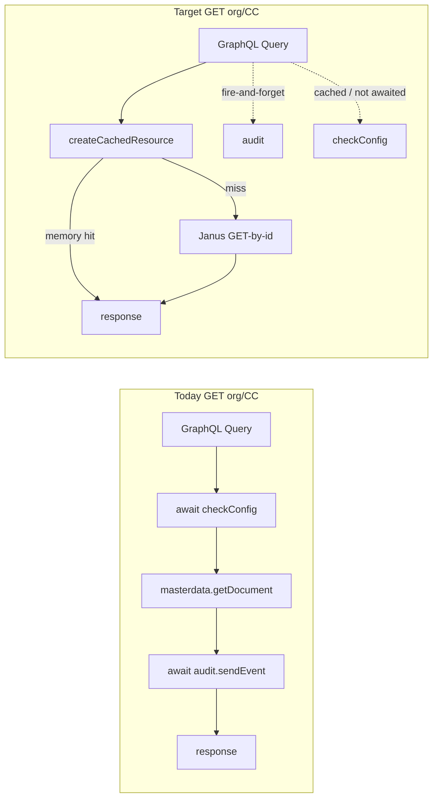

# Performance, caching and observability

| Field | Value |
|---|---|
| Status | Done |
| Repo | `vtex.b2b-organizations-graphql` |
| Source of patterns | `/Users/wender/projects/vtex/storefront-permissions` (PR of session-transform performance) |
| How to implement | Mark this spec **Approved**, then in this repo ask the agent: `implement spec specs/performance-caching-and-observability.md` |

This spec ports the **reusable** performance, caching, and observability work from `vtex.storefront-permissions` into this app. It is **not** a copy of `setProfile`. This app is the GraphQL owner of organizations, cost centers, settings, and marketing tags — not a session transform.

---

## 0. Inventory from storefront-permissions (what we did vs what applies here)

| # | Improvement in storefront-permissions | Port to this app? | Why |
|---|---|---|---|
| 1 | Two-layer cache (`createCachedResource`: in-process LRU + VBase stale-while-revalidate) | **Yes** | `getOrganizationById` / `getCostCenterById` are the hottest GraphQL reads; SFP measured the GraphQL hop at ~1.8s median vs ~0.4s MD GET. Sibling apps and this app's own field resolvers still hit these queries. |
| 2 | Cache correctness: never cache failure; never cache a transient miss; never mutate a cached object | **Yes** | Same failure mode on a shared pod. |
| 3 | Tenant-scoped memory keys (`${account}-${workspace}-${key}`) | **Yes** | Pods are multi-tenant. VBase keys must **not** include account (client is already scoped). |
| 4 | Byte-bounded LRU for cost centers (~400B–29KB) | **Yes** | Same documents, same size spread. |
| 5 | Janus `MasterDataExtended` (`authToken`, GET-by-id + `searchDocuments`) instead of the default MD client on the hot path | **Yes** | SFP adopted this because the default `masterdata` client was slower. This app still uses `ctx.clients.masterdata.getDocument` / `searchDocumentsWithPaginationInfo` on every org/CC read. |
| 6 | Do not send `_schema` on GET-by-id of `organizations` / `cost_centers` | **Yes** (already true if using GET-by-id) | Search still needs `_schema` / `schema` from `mdSchema.ts` (`v0.0.8`). |
| 7 | Break the circular GraphQL hop SFP → this app → SFP for `getOrganizationsByEmail` | **Partial** | SFP no longer calls this app for that. This app's **own** `getOrganizationsByEmail` still calls SFP GraphQL (correct: `b2b_users` is SFP-owned) and then field resolvers N+1 GET org/CC. Hydrate in the parent + cache org/CC. |
| 8 | Prefetch independent work; only `await` what the response needs | **Yes, adapted** | GraphQL resolvers: do not `await checkConfig` or `await audit.sendEvent` before returning a GET. Fire-and-forget audit on reads. Cache `checkConfig`. Parallelize independent MD reads (field resolvers / hydrate). |
| 9 | `describeClientError` — never log a raw Axios/client error (PII in `config.data` / query string) | **Yes** | Today almost every `logger.error({ error, message })` passes the whole error. |
| 10 | Request timings: one structured log per slow/sampled/thrown request | **Yes, adapted** | Apply to the hottest GraphQL queries (`getOrganizationById`, `getCostCenterById`, `getOrganizationsByEmail`, `getOrganizationsPaginatedByEmail`), not a session middleware. Settings: sample rate + slow threshold (app settings or constants). |
| 11 | `cacheStats` log every 5 min (hit rate, size) | **Yes** | Piggyback on a hot query; no scheduler in IO apps. |
| 12 | Organization status rule in one module (`status === 'active'` only) | **Already owned here** | `node/utils/constants.ts` `ORGANIZATION_STATUSES` is the source of truth. `checkOrganizationIsActive` already uses `=== 'active'`. Do not loosen to `!== 'inactive'`. SFP copies this rule — keep them in sync. |
| 13 | Session transform flow, `setProfile` fire-and-forget cart/CL/marketing, region/SC session fields | **No** | Not a session app. `getB2BSettings` / `getMarketingTags` stay here (VBase `b2b_settings` / `b2b_marketing_tags`). |
| 14 | Session watcher, active-user cache keyed on `b2bCurrentCostCenter`, checkout region cache | **No** | SFP domain. |
| 15 | HTTP `forceMaxAge` 30 min on the Janus MD client | **No** | Conflicts with short org/CC TTL (deactivation must bite quickly) and "never cache a failure" (HttpClient can store errors). Application cache only. |
| 16 | `service.json` `memory: 1024`, `workers: 1` | **Already here** | Do not add workers (duplicates LRUs). |
| 17 | Schema hash scoped to app major (`settings-v{N}`) | **Already here** | `getSchemaSettingsKey()` in `node/resolvers/config.ts`. |
| 18 | Gating `debug` / full session payload logs | **No** (session-specific) | Optional: do not add payload dumps of org/CC documents with buyer emails unless behind an explicit setting default false. |

---

## 1. Business Context

### Problem

`vtex.b2b-organizations-graphql` is on the B2B storefront and admin critical path. Sibling apps (`storefront-permissions`, admin UI, checkout settings) call `getOrganizationById`, `getCostCenterById`, and `getOrganizationsByEmail` on every navigation and many admin screens.

Today each of those reads:

1. `await checkConfig(ctx)` — VBase + possible schema/template sync — **on every GET**.
2. Default Master Data client `getDocument` (measured slower than a Janus GET in SFP).
3. `await audit.sendEvent(...)` **on the response path** of GETs, with empty before/after payloads.
4. For `getOrganizationsByEmail`: GraphQL hop to SFP, then GraphQL field resolvers `organizationName` / `organizationStatus` / `costCenterName` each do another full `getDocument`.

There is no application-level cache. The only LRU in `node/index.ts` is attached to a `status` client that the rest of the app does not use. A cold pod and a warm pod pay the same origin cost. Failures are logged as raw client errors, which can carry emails and request bodies into the log pipeline.

`storefront-permissions` already stopped calling this app's GraphQL for org/CC on `setProfile` (it reads MD directly). This spec is so **this app** is fast for everyone else who still goes through GraphQL, and so its own resolvers stop amplifying MD with config-sync and audit writes.

### Who is affected

- Shoppers: any storefront call that still goes through this GraphQL (org switcher, quotes, checkout-settings, remaining SFP queries).
- Admins: organization/cost-center screens.
- Operators: logs full of unusable client errors; no per-step timings; no cache hit rates.
- SFP / other B2B apps: they depend on this GraphQL remaining correct; they should get it faster without contract changes.

### Goals

1. Cut origin cost of `getOrganizationById` and `getCostCenterById` on a warm pod to memory-only, and on a cold pod to VBase SWR after the first population.
2. Remove `checkConfig` and audit **from the GET critical path** without dropping schema sync or audit on mutations.
3. Collapse N+1 MD GETs when listing organizations by email.
4. Make logs safe (no PII from Axios) and actionable (timings on slow queries, cache stats).
5. Keep the GraphQL contract unchanged.

### Non-goals

- Changing GraphQL schema, persisted-query hashes, or field names.
- Moving `b2b_users` ownership out of SFP (mutations and user listing still go through `storefrontPermissions` client).
- Copying `setProfile`, session namespaces, or checkout side effects.
- HTTP-level `forceMaxAge` on Master Data.
- Increasing `workers` in `service.json`.
- Caching order forms, sessions, or other transactional state.

### User stories

#### US-1 — Cached organization and cost center reads

As a storefront or admin caller, I get `getOrganizationById` / `getCostCenterById` from memory on a warm pod and from VBase SWR on a cold pod, without a wrong document being served for the TTL after a blip.

**Acceptance**

- Given a successful origin read for org `O` (resp. cost center `C`), when the same account/workspace asks again within the memory TTL, then the fetcher is not called.
- Given a failed origin read, when the next request asks for the same id, then the origin is called again (failure was not stored).
- Given a missing document, when the next request asks for the same id, then the origin is called again (miss was not stored).
- Given two accounts on the same pod, when they share an id string, then they never receive each other's document.
- Given a caller that would mutate a cached org (e.g. defaulting `permissions`), when it returns, then the object in cache is still the origin snapshot (clone at the boundary).

#### US-2 — Janus Master Data on the hot path

As the service, GET-by-id of `organizations` and `cost_centers` (and bounded search used to hydrate lists) goes through a Janus client with `ctx.authToken`, not the default MD client.

**Acceptance**

- Given `getOrganizationById` / `getCostCenterById` / field resolvers that today call `masterdata.getDocument`, when this ships, then they read via the new client (or a cached wrapper over it).
- Given GET-by-id, when the request is built, then it does not send `_schema`.
- Given search of this app's entities, when a schema is required, then it uses the version from `node/mdSchema.ts`.
- Given writes, schema sync, and scroll/pagination admin lists, when they already use `masterdata` mutations, then they may stay on the default client unless a read in the same function is on the hot path.

#### US-3 — `checkConfig` off GET reads

As a GET caller, I do not wait for schema/template sync.

**Acceptance**

- Given `getOrganizationById`, `getCostCenterById`, `getCostCenterByIdStorefront`, `getOrganizations`, `getB2BSettings`, and other **Query** resolvers that today `await checkConfig(ctx)`, when they run, then they do not block on VBase/schema writes.
- Given a process that has never synced, when the first **Mutation** (or a background/cached check) runs, then schemas still sync as today.
- Given `checkConfig` is still required after deploy, when a Query wants to be safe, then it may trigger sync **without awaiting** (fire-and-forget with `.catch` + logger), or rely on mutations + a short-TTL cached "already synced" flag.

#### US-4 — Audit does not block GET

As a GET caller, I do not wait for `audit.sendEvent`.

**Acceptance**

- Given Query resolvers that today `await audit.sendEvent` after a successful read, when they return, then the GraphQL payload does not wait on audit.
- Given audit rejects, when it does, then it is logged with `describeClientError` and does not fail the query.
- Given **Mutation** resolvers, when they write org/CC/user/settings, then they still await (or explicitly keep) audit as today — this story is GET-only.

#### US-5 — Hydrate organizations-by-email without N+1

As a caller of `getOrganizationsByEmail` / paginated variant, I get `costCenterName` / `organizationStatus` / `organizationName` without one MD GET per field per row on a cache miss, and with cache hits on repeat ids.

**Acceptance**

- Given a list of N user-org rows from SFP, when this app hydrates names/status, then unique `orgId` / `costId` are fetched once (parallel), using the org/CC cache from US-1.
- Given GraphQL field resolvers still exist for other queries, when they run in the same request after the parent hydrated, then they reuse `ctx.state` or the application cache rather than issuing a duplicate GET.
- Given SFP `b2b_users` remains the source of which orgs a buyer belongs to, when this app lists by email, then it still calls SFP GraphQL (or an equivalent SFP contract) — do not duplicate `b2b_users` search in this app unless SFP exposes a cheaper read that this spec is updated to use.

#### US-6 — Safe logs and timings

As an operator, I can see why a slow query was slow and I never see emails or address payloads in error logs from client failures.

**Acceptance**

- Given a client/Axios failure, when it is logged, then the payload is `describeClientError(error)` (status, method, path without query, operationId, redacted message) — not `error` whole.
- Given `getOrganizationById` / `getCostCenterById` / `getOrganizationsByEmail` exceeding the slow threshold (default 1000ms) or throwing, when the resolver finishes, then one log line includes per-step ms and total.
- Given cache use, when five minutes have passed on a pod, then one `cacheStats` info log reports hit rates/sizes.

### Key scenarios

| Type | Scenario | Expected |
|---|---|---|
| Happy path | Warm pod, `getCostCenterById` for a cost center read 200ms ago | Memory hit; no MD; no checkConfig wait; no audit wait; GraphQL body unchanged |
| Happy path | Cold pod, sibling already populated VBase | SWR returns stale immediately; background refresh; no GraphQL hop to anyone |
| Error | Master Data 500 on GET org | Query fails this request; next request retries origin; cache empty for that key |
| Error | Audit timeout on GET | Query still 200 with the document; audit error logged safely |
| Edge | Org deactivated (`inactive` / `on-hold`) | Next GET within TTL may still serve cached **document** (TTL is 60s/2min on purpose). `checkOrganizationIsActive` keeps `=== 'active'`. Do not cache "is active" as a separate forever key. |
| Edge | Cost center document 29KB | Stored only if it fits the byte budget; oversized document is returned but not retained in memory |
| Edge | Same cost center id, two accounts | Isolated by account+workspace in memory |

---

## 2. Arch Decisions

### Approach

Copy the **cache and MD-client patterns** from storefront-permissions, not the session handler.

Reference files in SFP (read and adapt; do not import across apps):

- `node/services/cache.ts` — `createCachedResource`
- `node/utils/staleFromVBaseWhileRevalidate.ts`
- `node/clients/masterDataExtended.ts` — Janus GET + search, **no** `forceMaxAge`
- `node/utils/clientError.ts` — `describeClientError`
- `node/utils/requestTimings.ts` + the idea of `withRequestTimings` (implement as resolver helpers, not session middleware)
- `docs/PERFORMANCE_AND_CACHING.md` — rules of thumb

Wire them in this app's `node/` following existing resolver layout (`resolvers/Queries/Organizations.ts`, `CostCenters.ts`, `fieldResolvers.ts`, `config.ts`).



### Decision 1 — Application cache, not HttpClient cache

Use `createCachedResource` (LRU + optional VBase SWR). Do not set `memoryCache` / `forceMaxAge` on the Janus MD client.

**Why:** HttpClient caches HTTP failures and cannot encode "never cache a miss". Org deactivation must take effect in minutes.

**Rejected:** 30 min Janus `forceMaxAge` from an earlier SFP experiment.

### Decision 2 — TTLs match SFP org/CC (status is blocking)

| Resource | Memory | VBase | Bound | Key |
|---|---|---|---|---|
| organization | 60s | 2 min | ~10000 entries | orgId |
| cost-center | 60s | 2 min | 8MB byte budget | costId |
| checkConfig / schema-synced | 5 min memory | omit VBase (already VBase-backed settings) | 1 per tenant | `synced` |
| getB2BSettings | 5 min | 5 min | 100 | `settings` |

B2B settings already live in this app's VBase (`b2b_settings`). A VBase-backed cache of that document would swap one VBase read for another — **memory-only** is enough unless measurement shows the JSON parse dominates.

### Decision 3 — Janus client for hot reads only

Add `MasterDataExtended` (Janus, `VtexIdClientAutCookie: context.authToken`) with `getDocumentById` and `searchDocuments`. Metrics: `masterdata-get-document`, `masterdata-search`.

Keep default `masterdata` for `createOrUpdateSchema`, writes, and existing paginated admin searches unless a specific Query is proven hot.

### Decision 4 — GET path must not await config sync or audit

- Queries: stop `await checkConfig`; stop `await audit.sendEvent`.
- Mutations: keep `await checkConfig` and audit as they are (writes must see schema).
- Optional: fire-and-forget `checkConfig` on Query if the in-memory "synced" flag is cold, so a read-only workspace still converges.

### Decision 5 — Hydration uses the same org/CC cache

`getOrganizationsByEmail` keeps the SFP GraphQL call for the user-org list. After the list returns, unique org/CC ids are loaded via US-1 (parallel `Promise.all`). Field resolvers become thin (read cache / `ctx.state`) so other queries that still use them benefit.

Do **not** reimplement `b2b_users` search in this app. That entity is SFP-owned (`mdSchema` `b2b_users` v0.1.2).

### Decision 6 — Observability

Port `describeClientError` verbatim in spirit (redact emails, strip query strings, keep status/operationId).

Port timings as `timer.track('getDocument', ...)` inside the hot Query resolvers; emit one log when `totalMs >= 1000` or the resolver throws. Do not log every successful fast GET.

Port `cacheStats` every 5 minutes on a hot Query.

### Decision 7 — Tests first on cache rules

Jest is already in this repo (`node/jest.config.ts`, existing `*.test.ts`). Add tests beside SFP's `node/__tests__/cache.test.ts` patterns: tenant isolation, no cache of failure, no cache of miss, no mutation of cached objects, byte budget. Mock `vbase` and the Janus client.

Do not add a full GraphQL integration suite unless one already exists for that resolver.

### Risks

| Risk | Mitigation |
|---|---|
| Stale org status for up to ~2 min after admin deactivates | Same trade-off SFP accepted; document in CHANGELOG; TTL is the knob |
| Audit volume drop on GETs (events become async / best-effort) | Mutations still await; GET events were empty before/after anyway |
| Janus MD 404 vs empty string (default client returns `''`) | Normalize in the client wrapper; do not cache miss |
| `permissions` default `{ createQuote: true }` mutating cache | Shallow-clone before assigning defaults (`getOrganizationById` already spreads `org`) |
| Field resolver behavior change if parent does not hydrate | Resolvers still work via cache miss → Janus GET |

---

## 3. Technical Contract

### GraphQL (unchanged)

No schema changes. These operations stay:

- `Query.getOrganizationById`, `getCostCenterById`, `getCostCenterByIdStorefront`
- `Query.getOrganizationsByEmail`, `getOrganizationsPaginatedByEmail`
- Field resolvers: `organizationName`, `organizationStatus`, `costCenterName`
- `Query.getB2BSettings`, `getMarketingTags`
- All existing Mutations

Persisted-query provider/sender strings stay.

### New / adapted modules (this app)

| Module | Responsibility |
|---|---|
| `node/clients/masterDataExtended.ts` | Janus GET-by-id + search; app `authToken`; no forceMaxAge |
| `node/clients/index.ts` | Register `masterDataExtended` |
| `node/services/cache.ts` | `createCachedResource` + `collectCacheStats`; tenant memory keys |
| `node/utils/staleFromVBaseWhileRevalidate.ts` | Cross-pod SWR; hashed VBase filenames (logical keys may contain ids) |
| `node/utils/clientError.ts` | `describeClientError` |
| `node/utils/requestTimings.ts` | `createTimer` / `track` |
| `node/services/organizationsCache.ts` | Wrappers `getCachedOrganization` / `getCachedCostCenter` |
| `node/utils/constants.ts` or adjacent | Cache TTL constants (do not collide with `ORGANIZATION_STATUSES`) |

VBase cache bucket: e.g. `b2b-orgs-cache` (do not reuse SFP `sfp-cache`). Do not put account in VBase keys.

### Fetcher contract

```
getCachedOrganization(ctx, orgId, () => {
  return masterDataExtended.getDocumentById(ORGANIZATION_DATA_ENTITY, orgId, ORGANIZATION_FIELDS)
    .then(doc => { if (!doc) { throw Object.assign(new Error('organizationNotFound'), { organizationNotFound: true }) } return doc })
})
```

Call site maps `organizationNotFound` / HTTP 404 to the current GraphQL error behavior **outside** the cache. Same for cost centers.

`getOrganizationById` must clone before adding `permissions: org.permissions ?? { createQuote: true }`.

### `checkConfig`

Keep implementation in `node/resolvers/config.ts`. Add an in-memory per-tenant flag (TTL ~5 min) so repeated Queries do not hit VBase. Mutations continue to `await checkConfig(ctx)`.

### Audit

Query: `void audit.sendEvent(...).catch(err => logger.error({ error: describeClientError(err), message }))`.

Mutation: unchanged await.

### Logging

Replace `logger.error({ error, message: '...' })` on client failures in files touched by this spec (Queries org/CC, field resolvers, config, storefrontPermissions client errors on the hydrate path) with `describeClientError`. Do not rewrite every file in the repo in one PR if that explodes the diff — at minimum every file this spec changes.

### `service.json`

No change required (`memory: 1024`, `workers: 1`, `timeout: 60` already match SFP).

### Outbound policies

Janus MD already covered by existing `outbound-access` to `portal.vtexcommercestable.com.br` `/api/*` (and IO Master Data). Do not add new hosts.

### Implementation order

1. `describeClientError` + use it in org/CC Query catch blocks (safe, no behavior change).
2. `MasterDataExtended` + switch GET-by-id in `getOrganizationById`, `getCostCenterById`, field resolvers.
3. `createCachedResource` + SWR + org/CC wrappers + tests (US-1).
4. Stop awaiting `checkConfig` and audit on Queries (US-3, US-4).
5. Hydrate `getOrganizationsByEmail` via unique ids + cache (US-5).
6. Timings + `cacheStats` (US-6).

### Done when

- All US acceptance criteria have automated tests or, for fire-and-forget audit/config, a unit test that the Query resolves without the audit mock having been awaited.
- `yarn test` in `node/` passes.
- GraphQL operation names and payloads for a successful org/CC get remain compatible (extra cache headers internally are fine; the JSON `data` shape does not change).
- CHANGELOG notes: GET latency, cache TTLs, audit-on-read now best-effort.

### Trigger for the implementing agent

1. Set **Status** in this file to `Approved` (or tell the agent the spec is approved).
2. In `/Users/wender/projects/vtex/b2b-organizations-graphql`, run: implement spec `specs/performance-caching-and-observability.md`.
3. The implementing skill opens a PR on `feat/performance-caching-and-observability` and moves Status to `Done`.
